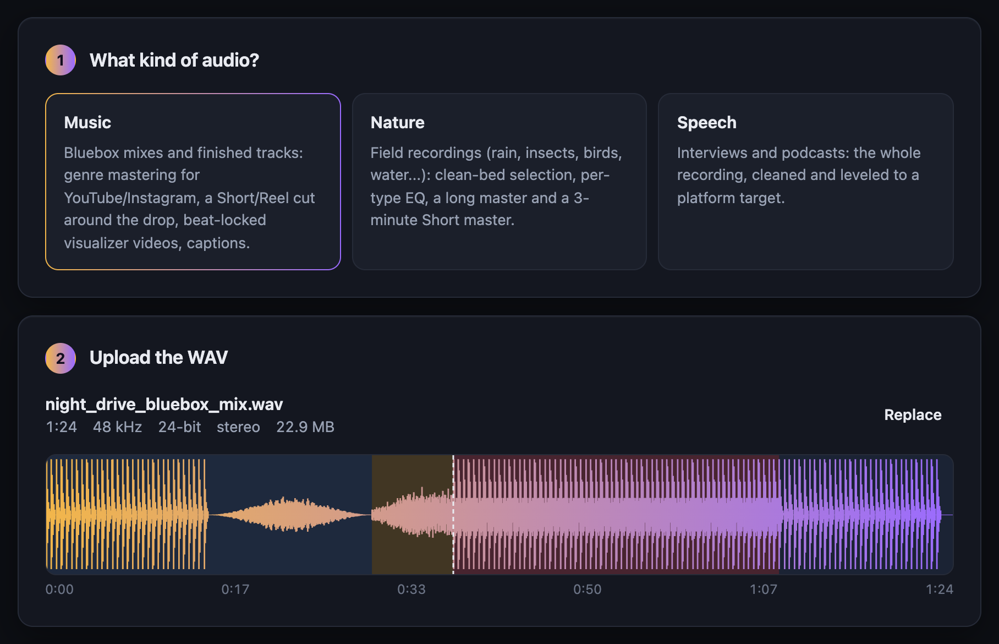
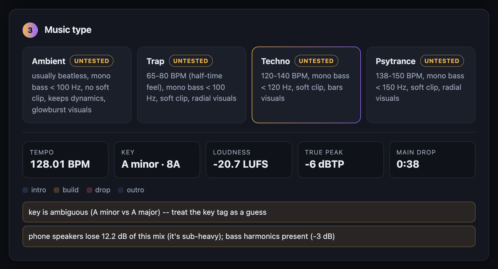
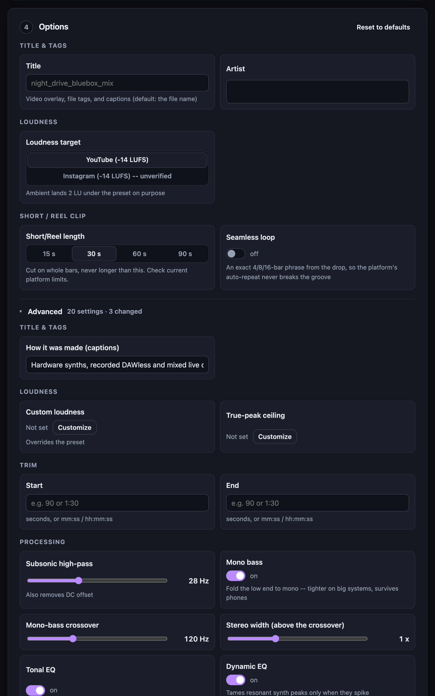
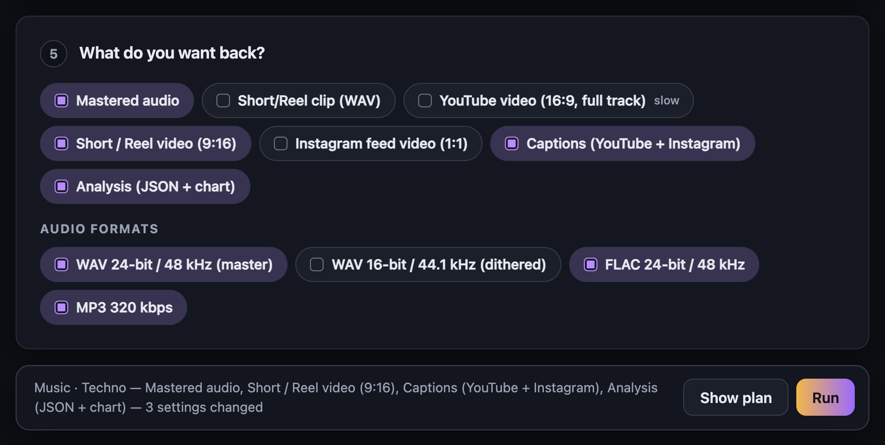
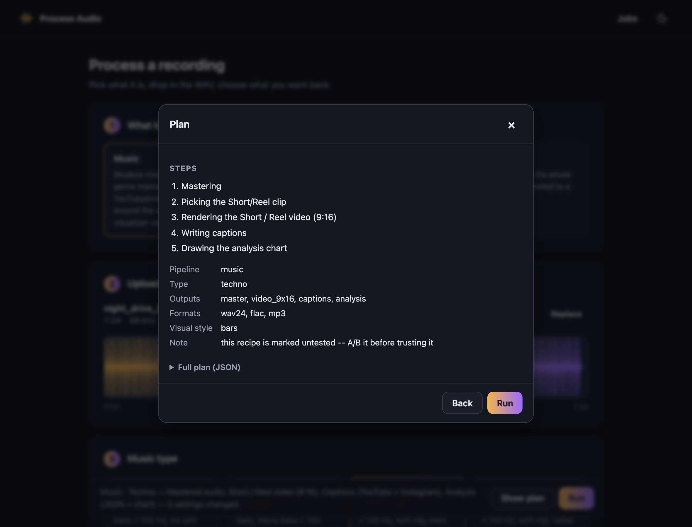
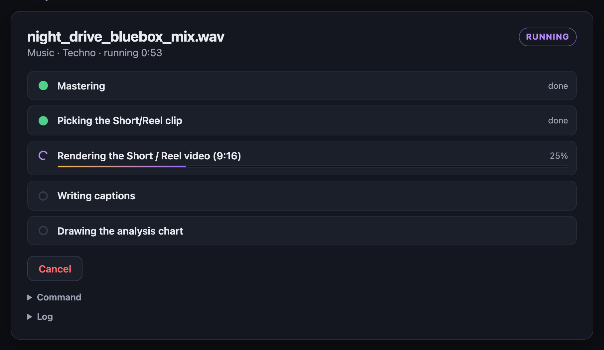
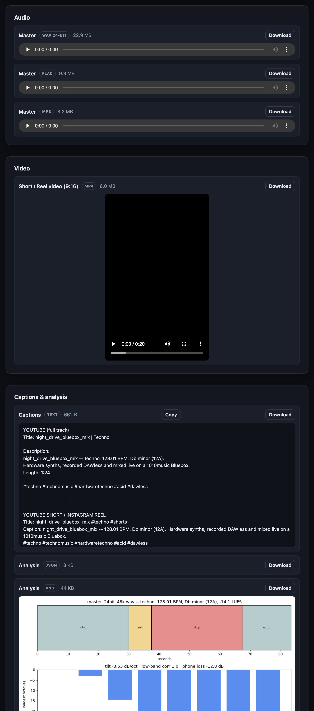
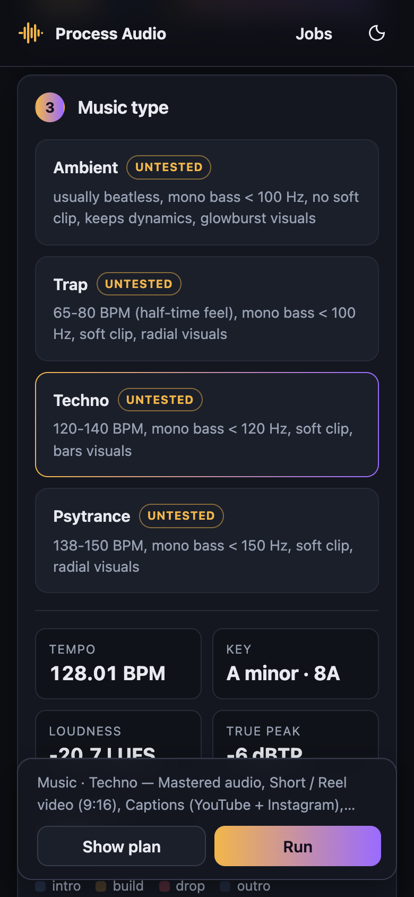
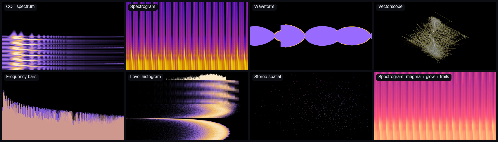

# process-audio

ffmpeg/Python pipelines for three kinds of audio, plus a browser app to run them:

- **Music** -- Bluebox mixes and finished tracks (ambient, trap, techno,
  psytrance): tempo/key/drop analysis, genre mastering for YouTube and
  Instagram, a Short/Reel cut around the drop, beat-locked visualizer
  videos, and captions.
- **Nature** -- raw field recordings (rain, thunder, insects, birds,
  brooks, waterfalls, mixed ambience) turned into cleaned,
  loudness-normalized "long" and "Short" masters for YouTube, optionally
  muxed with a still image into ready-to-upload MP4s.
- **Speech** -- interviews and podcasts, cleaned and leveled to a platform
  loudness target.

Every pipeline can write WAV 24-bit, WAV 16-bit, FLAC, and MP3. None of
them deletes your source file or guesses a recipe for content it doesn't
recognize. The tunable parts (EQ chains, loudness targets, detection
thresholds) live in `recipes.json` and `music_recipes.json`, not in code.

## Run it with Docker (easiest)

The whole thing -- web app, Python pipelines, ffmpeg, fonts -- comes as
one image, so the only thing you need installed is Docker
([Docker Desktop](https://www.docker.com/products/docker-desktop/) on a
Mac or Windows).

```bash
docker run -d --name process-audio \
  -p 127.0.0.1:8765:8765 \
  -v process-audio-data:/data \
  ghcr.io/tomott12345/process-audio:latest
```

Then open http://127.0.0.1:8765. Uploads and finished jobs live in the
`process-audio-data` volume, so they survive restarts and upgrades.

- **Upgrade:** `docker pull ghcr.io/tomott12345/process-audio:latest`,
  then `docker rm -f process-audio` and rerun the command above. Your jobs
  stay in the volume.
- **Stop:** `docker stop process-audio`.
- **Compose:** `docker compose up -d` with the repo's `compose.yaml` does
  the same thing (`--build` builds from your checkout instead of pulling).
- **Build it yourself:** `docker build -t process-audio .`
- **Voice/footstep removal (Demucs):** it's left out of the image because
  torch adds several GB. Add it with
  `docker build --build-arg WITH_DEMUCS=1 -t process-audio:demucs .`
- **Check an image:**
  `docker run --rm --entrypoint python3 -w /app ghcr.io/tomott12345/process-audio -m pytest -q`
  runs the full test suite inside it.

Keep the port on `127.0.0.1` as shown. The app has no login yet, and
anyone who can reach the port can upload files and run jobs. Images are
built for both Intel/AMD (amd64) and Apple Silicon/ARM (arm64). Inside
Docker, videos encode with x264 rather than the Mac's hardware encoder,
so ffmpeg-style renders are somewhat slower than running natively.

## Web app

`web/` is a Go server with a browser front end for all three pipelines.
Upload a WAV, pick what it is, choose options and outputs, then watch it
run and download the results. It runs locally; your audio never leaves the
machine.

```bash
cd web
go build -o bin/paweb ./cmd/paweb
bin/paweb                      # then open http://127.0.0.1:8765
```

Needs Go 1.24+, plus the same Python and ffmpeg setup as the scripts
(see Requirements below). Full details are in [web/README.md](web/README.md).

**1. Pick the kind of audio and drop in the WAV.** Length, format, and the
waveform appear straight away. Once a music file is analyzed, its sections
(intro / build / drop / outro) are shaded and the main drop is marked.



**2. Pick the type.** Music and nature files are analyzed automatically:
tempo, key (with Camelot), loudness, true peak, the main drop, and plain
warnings such as bass that will vanish on phone speakers.



**3. Options.** The everyday settings are always visible. Everything else
is under **Advanced**, collapsed by default. Each option starts at the
recipe's default for the chosen type. Changed ones are highlighted with a
*reset* link, and options that don't apply are hidden or greyed out with
the reason.



**4. Outputs and formats.** Choose what you want back: mastered audio in
any mix of WAV 24/16-bit, FLAC, and MP3; the Short/Reel clip; YouTube
16:9, Short/Reel 9:16, and Instagram 1:1 videos; captions; the analysis.



**5. Show plan** lists exactly what will run before anything renders.



**6. Run.** Progress streams live, including frame-by-frame percentages
while videos render, and you can cancel at any point.



**7. Results.** Players for every audio and video file, captions with a
Copy button, the analysis chart, per-file downloads, and a zip of
everything. **Edit & run again** loads the job back into the form.



It works on a phone, and follows your light/dark setting (the screenshots
are dark).



## Requirements

- `ffmpeg` / `ffprobe` on your PATH (with `afftdn`, `adeclick`, `adeclip`,
  `acrossfade`, `alimiter`, `loudnorm`, `equalizer`, `deesser`,
  `acompressor`, `silenceremove` -- a normal full-featured build has all of
  these)
- Python 3, plus the packages in `requirements.txt`:

  ```bash
  pip3 install -r requirements.txt --break-system-packages
  ```

  That's `numpy`/`scipy` for the nature pipeline's bed analysis and looping
  (`process_speech_wav.py` doesn't need either -- it's pure ffmpeg). Two
  features have their own heavy, genuinely optional dependencies, listed
  separately in `requirements-optional.txt` rather than bundled in here so
  installing the repo doesn't pull in a multi-GB `torch` download by
  default: `--denoise-profile-*` needs `noisereduce`, and
  `--remove-voice`/`--remove-voice-at` needs `torch` + `demucs`. Install
  either only if you're using the flag that needs it:

  ```bash
  pip3 install -r requirements-optional.txt --break-system-packages
  ```

Each script checks its own dependencies at startup (or lazily, only when a
flag that needs an optional one is passed) and fails with a clear message
-- including an install hint -- if anything is missing, rather than a raw
traceback.

## Quick start

```bash
./process_field_wav.sh take.wav --label rain --place porch --long clean
```

`--start`/`--end` override the automatic bed selection. `--start` is seconds to trim from the beginning (e.g. `5`); `--end` takes either seconds or an `mm:ss` / `hh:mm:ss` timestamp to cut off at:

```bash
./process_field_wav.sh take.wav --label thunder --place porch --start 5 --end 3:45
```

If you skip `--label`/`--place` (or pass `--ask`), it prints the questions it
needs answered instead of guessing:

```bash
./process_field_wav.sh take.wav --ask
```

Preview the chosen bed, EQ chain, and loudness targets without rendering
anything (handy before committing to a long render):

```bash
./process_field_wav.sh take.wav --label birds --place woods --plan-only
```

Loop the long master to a specific length -- an hour, say, for a background
video -- instead of leaving it at native bed length:

```bash
./process_field_wav.sh take.wav --label rain --place porch \
  --loop force --loop-target 1:00:00
```

`--loop-target` accepts seconds or an `mm:ss`/`hh:mm:ss` timestamp. It reuses
the same two loop-construction methods as the Short, resolved by `--loop`
the same way: hard-splice tiling (short ~12ms linear splices, no audible
dip) for correlated water content -- rain/thunder/water/brook -- or whenever
you pass `--loop force`; the equal-power wrap otherwise. If the clean bed is
already at or past the target length, it's just trimmed to exactly that
length rather than extended. Loudness normalization, fades, and the limiter
are applied once to the finished full-length file, not per repeat.

Process a whole folder or a mixed-content manifest at once:

```bash
./batch_process.py --dir ./card_dump --label insects --place woods
./batch_process.py --manifest takes.csv
```

## Content types

`rain | thunder | insects | mixed | water | brook | birds | waterfall | wind |
fire | ocean | frogs` -- each with its own EQ chain, loudness targets, and
bed-selection strategy in `recipes.json`. Add a new content type by adding an
entry there; the script refuses to run (with a clear error) if a label is
missing a required key, rather than silently reusing another label's recipe.

`birds`, `waterfall`, `wind`, `fire`, `ocean`, and `frogs` are marked
`"untested": true` in `recipes.json` -- they're a reasoned starting point
(EQ bands picked for each content type's actual spectral shape, not copied
from a neighbor) but haven't been validated against real takes yet. A/B them
against a few real recordings before trusting them unattended, and tighten
the recipe (or the `clean_run_detector` factors) as needed.

A label's `activity_band: [lo_hz, hi_hz]` (optional; defaults to 2500-9000,
tuned for insects/birds) controls what frequency range counts as "activity"
for `bed_selection: activity`. `frogs` overrides this to `[300, 2500]`,
since typical frog/toad calls sit well below cricket/cicada chirp range --
without this override, activity-based bed selection would just find
whatever run has the most incidental high-frequency insect energy, not the
best frog chorus. Species vary a lot in call pitch, so treat this as a
starting point to tune per recording, same as the EQ.

## How bed selection works

`analyze_windows.py` scores the recording in 1-second windows and flags a
window "dirty" (handling noise, wind rumble, a stray thump) *relative to that
file's own measured baseline* rather than a fixed absolute loudness -- so a
continuously loud waterfall or a recording full of legitimate bird chirps
doesn't fail to find a usable "clean" bed just because it isn't a quiet porch
recording. Genuine digital clipping is still flagged on an absolute basis.

`process_field_wav.py` then picks a bed from the clean runs using the
strategy in the label's recipe: the longest clean run (weather/water/wind/
ocean), the highest-activity run (insects/birds/fire/frogs -- each over its
own `activity_band`), or a comparison of the two (mixed).

## Spoken word: interviews and podcasts

`process_speech_wav.py` is a separate, standalone script for dialogue --
interviews, panels, solo podcast episodes -- not a mode of the nature
pipeline above. That's deliberate: this pipeline's whole design (bed
selection, looping) is built around *ambient texture* that's repeat-tolerant
and doesn't need every second kept. Speech is the opposite -- every word
matters and it isn't repeat-tolerant -- so the speech script skips bed
selection and looping entirely and just processes the recording (or your
`--start`/`--end` span) once, start to finish.

```bash
python3 process_speech_wav.py interview.wav --preset apple
```

Chain: highpass (rumble/plosives) -> gentle presence EQ -> de-esser (tame
sibilance) -> gentle compressor (evens out level swings between mic
distance/energy/speakers) -> two-pass loudnorm to a podcast loudness target
-> short fades -> true-peak limiter. `--no-compress`/`--no-deess` skip
either step if you'd rather handle it yourself.

`--preset` picks a loudness target: `apple` (-16 LUFS), `spotify` (-19
LUFS), `youtube` (-14 LUFS), or `general` (-16 LUFS, the default). These
are commonly-cited platform targets, not fetched from a live spec -- confirm
against each platform's current published loudness guidance before assuming
they haven't moved. `--target-i`/`--target-tp`/`--target-lra` override
individual values if you need something else. `--mono` downmixes before
normalizing, since several platforms define their loudness target for mono.

`--trim-silence` trims only leading/trailing silence (never touches
mid-file pauses -- it uses ffmpeg's `silenceremove` in "leading edge" mode
on the file and its reverse, specifically because the naive stop-at-silence
approach mistakes an ordinary conversational pause for the end of the
recording and truncates the file there). `--silence-threshold` (default
-45dB) tunes what counts as silence.

`--plan-only` prints the resolved chain and targets without rendering.

## Music: mastering and releasing tracks (EDM / DAWless)

A third, separate pipeline for finished tracks -- built around a
1010music Bluebox mix of hardware synths, in ambient, trap, techno, and
psytrance, released on YouTube and Instagram. It's not a mode of the
nature or speech scripts: it knows about tempo, bars, key, drops, and
club-style mastering, which neither of those does. See
`MUSIC_FEATURES_PLAN.md` for the full roadmap; this is milestone 1.

One command, mix in, upload-ready files out:

```bash
python3 release.py bluebox_mix.wav --genre techno --title "Night Drive" --artist "Thomas Ott"
```

That masters the mix, picks a Short/Reel excerpt around the drop, renders
a beat-locked full-length 16:9 video and a 9:16 Short/Reel (`--square` adds
a 1:1 feed post), and writes `captions.txt`. Rendering video is the slow
part -- add `--max-seconds 20` for a quick preview of both videos first,
or `--no-landscape` to skip the full-length one. Each step is one of the
scripts below, run as-is, so any of it can be redone by hand.

`--genre` is required and never guessed (`ambient | trap | techno |
psytrance`): it sets the tempo range, the EQ/dynamics recipe, and the
default visual style, all in `music_recipes.json`. Every genre recipe is
marked `"untested": true` until it's been A/B'd against real Bluebox mixes.

**`music_analyze.py`** -- read-only analysis, written to
`music_analysis.json` (`--png` adds a one-page chart; needs matplotlib):

- tempo and a beat/bar grid, by a constant-tempo comb search inside the
  genre's range (hardware on one clock doesn't drift). Searching only in
  range is what keeps trap at its ~70 BPM half-time feel instead of 140;
  the double-time grid is kept internally for visual sync. The grid is
  snapped to where the kick attacks actually start in the waveform, so
  bar cuts don't clip them. Ambient usually has no steady beat and is
  reported as "no grid" -- everything downstream then works in seconds.
- key, in standard and Camelot notation (chroma from C3 up, so a saw
  bass's overtones don't turn minor keys major); a low-confidence key is
  flagged as a guess
- loudness (integrated, LRA, true peak, PLR), DC offset, clipped samples
- stereo checks: correlation below the genre's mono-bass crossover and
  mono-sum loss
- a phone-speaker check: how much the mix loses below ~150 Hz, and whether
  the bass is close to a pure sine (it then vanishes on a phone -- the fix
  is harmonics on the bass, not more low end)
- sections (intro / build / drop / breakdown / outro; quiet / swell / peak
  for ambient) and the main drop. Labels are heuristic -- `pick_clip.py`
  shows its reasoning and takes an override.

**`process_music_wav.py`** -- the mastering chain: subsonic high-pass (also
removes DC) -> mono-bass below the genre crossover (optional `--width` only
ever above it) -> tonal EQ -> optional dynamic EQ -> glue compression ->
static gain to the loudness target -> tanh soft-clip -> true-peak limiter
(both at 4x the sample rate, band-limited before the limiter so the
downsample doesn't overshoot) -> fades. It re-measures and corrects until
it lands within 0.3 LU of the target and under the true-peak ceiling. This
deliberately doesn't use `loudnorm`: its dynamic mode pumps on music, and
its linear mode silently falls back to dynamic whenever the needed gain
would exceed the true-peak ceiling -- every EDM master. Outputs
`master_24bit_48k.wav` and a triangular-dithered `master_16bit_44k1.wav`,
tagged with title/artist/genre and BPM/key, plus a `REPORT.txt` with
before/after QC.

```bash
python3 process_music_wav.py mix.wav --genre trap --preset instagram --start 0:12 --end 3:40
```

`--preset` is `youtube` (-14 LUFS, -1 dBTP) or `instagram` (treated the
same until measured -- Instagram publishes no target; upload a private test
Reel, download it back, and run `music_analyze.py` on it). Ambient lands
2 LU under the preset on purpose and skips the soft-clipper.

**`pick_clip.py`** -- cuts the Short/Reel: a whole number of bars no longer
than `--length` (default 30s), starting 1-4 bars before the main drop so
the build lands in the clip, fading over the last bar. `--loop` cuts an
exact 4/8/16-bar phrase starting on the drop with 2 ms edge fades, so the
platform's auto-repeat seams on a downbeat. `--drop-at` / `--start`
override the choice; `--plan-only` explains it without cutting. Ambient
gets the highest-energy window with slow fades. Platform length caps
change often -- check current limits; nothing here enforces one.

**`visualize_wav.py --grid music_analysis.json`** locks beat punch and the
emoji pulse to the analyzed grid (downbeats accented, calmer in
intros/breakdowns) and flashes on each drop; with no grid (ambient) it
keeps onset detection. Videos now encode 48k / 320k AAC with `+faststart`.

These need `librosa` (the visualizer's optional dependency) plus the core
numpy/scipy; see `requirements-optional.txt`. Analysis decodes the whole
file at 22.05 kHz -- about 480 MB of RAM for a 45-minute stereo jam.

## Driving the pipelines from another program

Every pipeline (music via `release.py`, nature via `process_field_wav.py`,
speech via `process_speech_wav.py`) shares one machine-readable interface,
built for the web app but usable by anything:

- `python3 pipeline_capabilities.py` prints the pipelines, content types,
  options (with per-type defaults, ranges, Basic/Advanced, dependencies,
  and the exact flag each maps to), outputs, and formats as JSON.
  `build_argv()` in the same file is the reference form-to-command-line
  mapping.
- `--formats wav24,wav16,flac,mp3` on every pipeline: each format is
  encoded from the 24-bit/48k master and tagged. The defaults are
  unchanged: wav24 for nature and speech, wav24+wav16 for music.
- `--plan-only --json` prints the resolved plan as a single JSON document.
- `--progress-json` adds `@@progress {...}` lines to stdout: a `plan`
  event first, step start/progress/end events, and a `manifest` of the
  deliverables last.
- `release.py --outputs master,clip,video_16x9,video_9x16,video_1x1,captions,analysis`
  makes only what's asked for. Music mastering switches (`--no-eq`,
  `--no-glue`, `--mono-bass-hz`, `--fade-in`, `--softclip-threshold`, ...)
  work on both `process_music_wav.py` and `release.py`.
- `python3 audio_peaks.py take.wav` prints a waveform overview for drawing.

Tests: `pytest tests/` (add `-m "not slow"` to skip the renders).

## Removing unwanted noise or a voice/foreground

Two optional, narrower alternatives to full "stem isolation" (which isn't
realistic for nature-sound content -- separating rain from crickets from
birds with off-the-shelf tools produces artifact-heavy results, so this
pipeline doesn't attempt it). These solve two specific, tractable problems
instead. Both live in `requirements-optional.txt` (see Requirements above)
if you'd rather install everything for a feature at once than run the
individual `pip3 install` commands below:

**A known, steady noise (hum, hiss, distant traffic, an AC unit)** --
`denoise_profile.py` samples a few seconds of *just that noise* (a stretch
with no wanted ambience) and spectrally subtracts its profile from the rest
of the file, via the `noisereduce` library. Point it at a span within your
already-trimmed bed:

```bash
./process_field_wav.sh take.wav --label rain --place porch \
  --denoise-profile-start 0 --denoise-profile-end 3
```

`--denoise-profile-start`/`--denoise-profile-end` are timestamps *within the
trimmed bed* (0 = start of the bed you end up with, after `--start`/`--end`
or automatic bed selection), not the raw source file. If the noise-only
sample lives outside the bed (or in a separate recording entirely), point at
it directly instead:

```bash
./process_field_wav.sh take.wav --label rain --place porch \
  --denoise-profile-file hum_only.wav
```

Add `--denoise-non-stationary` if the noise's character drifts over time
(default assumes it's steady), and `--denoise-prop-decrease 0.6` (0-1) to
subtract less aggressively if full removal (`1.0`, the default) eats into
the wanted ambience. Only needs `noisereduce`
(`pip3 install noisereduce --break-system-packages`); the script checks for
it and tells you if it's missing, only when you actually use this flag.

Can also be run standalone: `python3 denoise_profile.py --help`.

**An unwanted foreground that behaves like speech (a voice, footsteps, a
passing conversation)** -- `remove_foreground.py` runs Demucs' pretrained
vocal-separation model on the trimmed bed and keeps the non-vocal stem. This
is a real source-separation model, so unlike EQ or trimming it can remove
foreground content that overlaps in *time* with the ambience you want to
keep. It was trained to split music into vocals vs. everything else, not
built for field recordings, so results vary -- best on a clear, close
voice/footsteps against a quieter bed; worst when the unwanted sound is
soft or blends into the ambience:

```bash
./process_field_wav.sh take.wav --label rain --place porch --remove-voice
```

This is a genuinely heavy, optional dependency: `torch` + `demucs` (a GB+
download) plus pretrained model weights (~80MB, fetched on first run), and
it can take a couple of minutes per file on a CPU. It's not part of the
normal preflight check -- only checked when you actually pass
`--remove-voice`:

```bash
pip3 install torch --break-system-packages
pip3 install demucs --break-system-packages
```

`--voice-model` picks a different Demucs model if you want to experiment
(default `htdemucs`). Can also be run standalone:
`python3 remove_foreground.py --help`.

To clean only specific moments instead of the whole bed -- footsteps at a
known timestamp, a cough, a passing conversation -- use `--remove-voice-at`
instead of `--remove-voice`. It only runs Demucs on a short padded window
around each moment, then splices the cleaned span back in with a short
crossfade; everything else in the file is left completely untouched, and
it's much faster than processing the whole recording:

```bash
./process_field_wav.sh take.wav --label rain --place street --long full \
  --remove-voice-at 15 --remove-voice-at end --remove-voice-pad 4
```

Repeatable for multiple moments; `end` means the tail of the chosen bed.
Timestamps are in the same timeline as `--start`/`--end` -- the original
source file -- not the trimmed bed, since bed selection (or `--long full`'s
own 2s lead-trim) can already shift where the bed's t=0 actually falls
relative to your source recording. `--remove-voice-pad` (default 4s) is
how much padding to include on each side of the timestamp -- give the
footsteps room to actually sit inside the window with clean margin at the
edges for the splice. `--remove-voice` and `--remove-voice-at` are mutually
exclusive.

Both flags run against the already-trimmed bed, before EQ, and REPORT.txt
records what ran (noise span or file used, prop_decrease, model name) so a
month from now you can see exactly what was applied to a given master.
`--plan-only` prints what *would* run without actually invoking either
(no heavy processing, no dependency check).

## Audio visualization

`visualize_wav.py` renders an audio-reactive visualization video from a WAV
file -- a radial spectrum (bars pulsing outward from a center circle), a
classic bar-graph equalizer, or, for ambient material, a `glowburst`
sunburst or a `wormhole` tunnel -- and muxes it with the original audio into a
single mp4 via ffmpeg. Useful for turning a track into a YouTube Short/Reel
or a longer landscape upload without a separate video editor.

```bash
python3 visualize_wav.py input.wav output.mp4 --format shorts --style radial --title "Track Name"
python3 visualize_wav.py input.wav output.mp4 --format landscape --style bars
```

A third style, `glowburst`, is built for slow or beatless material (ambient
pads, drones) where spectrum bars just twitch. It draws a soft sun-like core
that breathes with loudness, tapered rays mirrored left/right in a
gold-to-violet sunrise ramp, and occasional shockwave rings on onsets (at
most one every 1.5s). Each band is rescaled to its own 2nd-98th percentile
range, so a dark mix with little treble still fills the whole burst instead
of collapsing to a cone of bass rays:

```bash
python3 visualize_wav.py track.wav out.mp4 --format landscape --style glowburst --title "Peaceful Sunrise"
```

`wormhole` flies you down a tunnel of rings. Each ring's outline is pushed
out by the spectrum and twists with depth, so bumps spiral down the tunnel,
and the tunnel slowly curves. Travel speed follows loudness and surges on
onsets, so a swell feels like acceleration. It uses the same per-band
rescaling as `glowburst`:

```bash
python3 visualize_wav.py track.wav out.mp4 --format landscape --style wormhole --title "Peaceful Sunrise"
```

`--format` is `shorts` (1080x1920), `landscape` (1920x1080), or `square`
(1080x1080). `--max-seconds N` renders only the first N seconds, useful for
a quick preview before committing to a full render. This is optional and
not wired into the main pipeline -- see requirements-optional.txt for its
dependencies (librosa, Pillow) and install with:

```bash
pip3 install librosa pillow --break-system-packages
```

The radial style has a stack of look/style options, all on by sensible
defaults: anti-aliasing (`--supersample`), motion trails (`--trail-decay`,
`--no-trails`), bloom/glow (`--glow-strength`, `--glow-radius`,
`--no-glow`), particles at active bar tips (`--particles`,
`--particle-rate`, `--max-particles`), a beat-reactive zoom on detected
onsets (`--beat-punch`, `--punch-strength`), and kaleidoscope/mandala
symmetry (`--symmetry N`, e.g. `--symmetry 6`). A center emoji that pulses
with the kick drum is also available for the radial style:

```bash
python3 visualize_wav.py input.wav output.mp4 --format shorts --emoji "❤️"
```

`--emoji-beat` picks what drives its pulse size -- `kick` (default,
bass-restricted onset detection so it responds to the kick drum rather
than every hit), `rms` (overall loudness), or `off` (static size).
`--emoji-size` and `--emoji-pulse` control base size and how much it grows
on a hit. Rendering uses a system color-emoji font when one is available
(Noto Color Emoji on Linux, Apple Color Emoji on macOS); a heart-like
request (`"❤️"`, `"♥"`, `"heart"`) falls back to a hand-drawn glowing
vector heart if no such font is found, so that case always works. Other
emoji need a color font present on the machine running the script -- it
warns and skips the emoji rather than failing if none is found.

Run `python3 visualize_wav.py --help` for the full flag list and defaults.

## ffmpeg visualizations

`ffmpeg_visualize.py` makes visualizer videos with ffmpeg's own
audio-visualization filters. Python only builds the command; ffmpeg draws
every frame, and on a Mac it encodes with the hardware H.264 encoder.
It's several times faster than real time, against roughly a quarter of
real time for the Python-drawn styles in `visualize_wav.py`. These styles
follow the sound itself rather than the analyzed beat grid.



| Style | Filter | What it shows | Its own options |
|---|---|---|---|
| `cqt` | showcqt | Musical (constant-Q) bars over a scrolling sonogram | note-name axis, sonogram on/off |
| `spectrum` | showspectrum | Scrolling spectrogram | 15 colour maps, movement (scroll / sweep / page), speed, intensity scale, orientation |
| `waves` | showwaves | Oscilloscope waveform | filled / lines / peaks / points, one lane per channel |
| `vectorscope` | avectorscope | Stereo field (lissajous or polar goniometer) | mode, line or dot drawing, zoom |
| `freqs` | showfreqs | Live frequency response | bars / line / dots, frequency scale |
| `histogram` | ahistogram | Level histogram over time | scroll or sweep, combined or separate channels |
| `spatial` | showspatial | Where each frequency sits in the stereo field | analysis window |

Shared options:
- `--palette` (gold-violet, neon, fire, ice, mono) colours the waveform
  and vectorscope directly. For CQT, frequency bars, and histogram, it maps
  brightness onto a black → colour → colour → white ramp. Those filters
  add the left and right channel colours together, so their own colours
  turn white on centred (mono) content.
- `--glow` adds a soft bloom, and `--trails` adds motion trails.
- `--title` adds a text overlay. This ffmpeg build has no `drawtext`, so
  the title is drawn as a PNG and overlaid.
- `--max-seconds` renders a preview.

```bash
python3 ffmpeg_visualize.py track.wav out.mp4 --style cqt --format landscape
python3 ffmpeg_visualize.py clip.wav short.mp4 --style spectrum --spectrum-color magma --glow --format shorts
```

In `release.py` and the web app, pick one as the visual style
(`--style spectrum`, or **Advanced → Video → Visual style**). Each style's
own options appear in the web app only when that style is chosen; on the
command line they're the `--viz-*` flags (`--viz-glow`,
`--viz-spectrum-color`, ...).

## Videos for nature and speech recordings

The nature and speech pipelines can also make visualizer videos, with the
same 11 styles and per-style options as music. Pick the video outputs in
the web app (or pass the flags below); the style and its options are under
**Advanced → Video**.

| Pipeline | 16:9 YouTube video | 9:16 Short / Reel | 1:1 feed post | Default style |
|---|---|---|---|---|
| Nature | from the long master | from the 3-minute Short master | from the Short master | Spectrogram |
| Speech | the whole recording | the whole recording | the whole recording | Waveform (an "audiogram") |

```bash
python3 process_field_wav.py take.wav --label rain --video-16x9 --video-9x16 --style spectrum --viz-spectrum-color viridis
python3 process_speech_wav.py episode.wav --video-9x16 --skip-master --style cqt --viz-glow --max-seconds 60
```

- **Only the videos you need are made.** A master a video needs is still
  produced even when you don't want it delivered (`--skip-long`,
  `--skip-short`, `--skip-master`); it just stays out of the downloads.
- **There's no beat grid outside music,** so the four Python-drawn styles
  follow the sound itself. They're slow: about a quarter of real time.
  A nature long master can be an hour long, so prefer an ffmpeg style or
  set a preview length (`--max-seconds`).
- **A speech 9:16 is the whole recording.** Trim it (`--start` / `--end`)
  or set a preview length for something Short-sized.

These pipelines also gained a few processing settings:
- **Speech:** the rumble/plosive high-pass frequency (`--highpass-hz`,
  40–200, default 90), the presence EQ on or off (`--no-eq`), and the fade
  length (`--fade`).
- **Nature:** the recording type's EQ curve on or off (`--no-eq`), and the
  fade length for each master (`--long-fade`, `--short-fade`).

## Layout

- `process_field_wav.py` / `process_field_wav.sh` -- the main nature-ambience
  pipeline
- `process_speech_wav.py` -- standalone dialogue/podcast processing (no bed
  selection, no looping)
- `analyze_windows.py` -- clean-run / bed-selection analysis
- `loop_crossfade.py` -- equal-power seamless loop builder
- `denoise_profile.py` -- noise-profile subtraction for a known steady noise
  (optional; needs `noisereduce`)
- `remove_foreground.py` -- Demucs-based voice/foreground removal (optional,
  heavy; needs `torch` + `demucs`)
- `batch_process.py` -- run the pipeline over a folder or CSV manifest
- `video_render.py` -- shared video plumbing (styles, `--viz-*` options, rendering) for all three pipelines
- `ffmpeg_visualize.py` -- fast visualizer videos from ffmpeg's built-in audio-visualization filters (7 styles)
- `visualize_wav.py` -- audio-reactive visualization video (radial, bar,
  glowburst, or wormhole), muxed with the source WAV into an mp4 (optional; needs
  `librosa` + `pillow`)
- `release.py` -- music: one command from a Bluebox mix to mastered audio,
  a beat-locked YouTube video, a Short/Reel, and captions
- `music_analyze.py` -- music: tempo/grid, key (Camelot), loudness,
  stereo/phone checks, sections and the main drop
- `process_music_wav.py` -- music: genre-recipe mastering chain for
  YouTube/Instagram
- `pick_clip.py` -- music: bar-aligned Short/Reel excerpt (or seamless loop)
- `music_common.py` -- shared helpers for the music scripts
- `pipeline_capabilities.py` -- all pipelines/options/outputs as JSON (+ `build_argv()`)
- `pipeline_io.py` -- shared output formats and `--progress-json` events
- `audio_peaks.py` -- waveform overview JSON for any audio file
- `tests/` -- pipeline contract + render tests; synthetic test audio generator
- `WEB_APP_PLAN.md` -- plan for the Go web front end
- `web/` -- the Go web app (API server + browser UI) -- see `web/README.md`
- `Dockerfile`, `compose.yaml`, `docker/requirements.txt`, `.dockerignore` -- the Docker image
- `.github/workflows/docker.yml` -- CI: tests the image on every PR, publishes it to ghcr.io from `master` and version tags
- `docs/images/` -- screenshots used in this README
- `music_recipes.json` -- music: per-genre recipes and loudness presets
- `recipes.json` -- per-label EQ chains, loudness targets, loop policy,
  clean-run detector tuning
- `requirements.txt` -- core Python dependencies (numpy/scipy)
- `requirements-optional.txt` -- heavy, feature-specific dependencies
  (noisereduce, torch, demucs) -- install only what you need
- `youtube-mux.md` -- listing/thumbnail conventions
- `ROBUSTNESS_PLAN.md` -- the analysis this rewrite was built from
